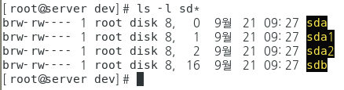
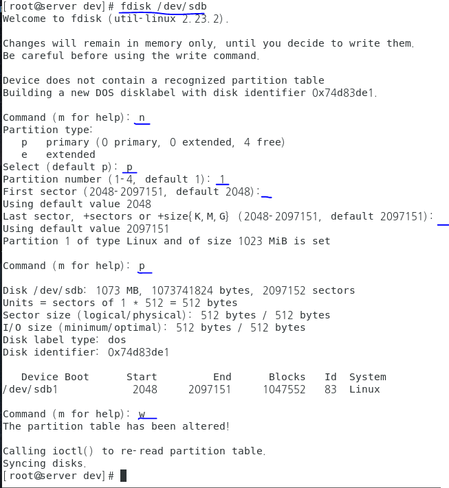
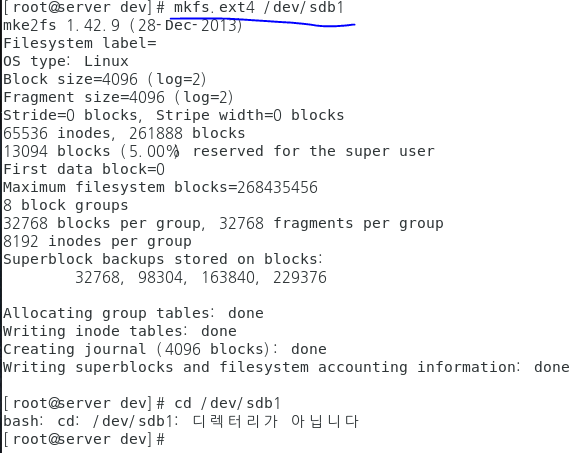
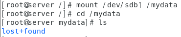
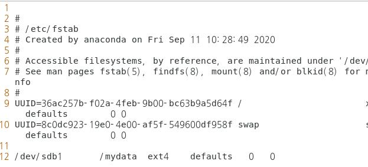

# 하드디스크 추가

* 빅데이터를 배우기 전 단계에서 RAID와 LVM에 대해 이해하고 다수의 하드디스크를 붙여서 사용해본다.

  

## vmware에서 하드디스크 추가 방법(336p)

1. Edit virtual machine 선택 후 왼쪽 아라에 Add 선택하여 하드디스크 선택 후 SCSI선택

2. Create a new virtual disk 선택 후 사이즈 설정(1GB)하고 Store virtual disk as a single file선택

3. 이름을 server-원하는숫자.vmdk로 설정(아무거나 ok)하고 finish

   * 만들어진 하드디스크는 지우려면 remove선택하면 된다.

4. 현재 상황은 다음과 같다.

   

   * sdb가 방금 만든 1GB짜리 새로운 하드디스크이다.

5. 장착한 하드디스크에 파티션 할당(340p)

6. 디스크를 포멧시켜준다. 포멧은 다음과 같다(341p)

7. 마운트한다(매핑)(컴퓨터를 재부팅하면 마운트는 해제된다)

   

## 재부팅해도 마운트가 해제되지 않도록 설정

* vi /etc/fstab로 들어가서 아래 그림과 같이 설정(344p)

  

