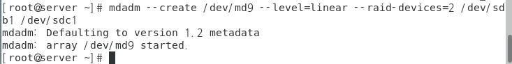
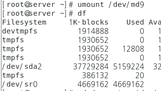
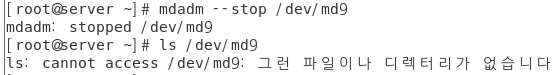
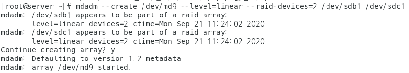
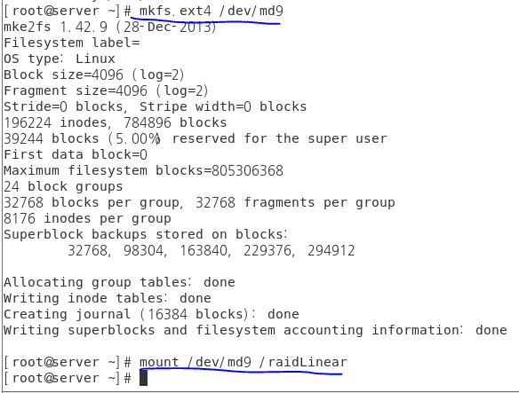
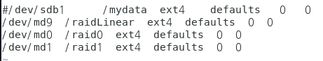
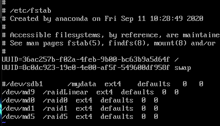
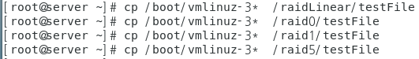

# RAID

* RAID는 여러개의 하드디스크를 하나의 하드디스크처럼 사용하는 방식. 비용절감과 신뢰성이 높으며 성능향상이 가능.

  * 하드웨어와 소프트웨어방식의 RAID가 있으며 현업에서는 하드웨어적 방식을 사용(비용비쌈)
  
  * 여기서 배울것은 소프트웨어적 방식
  
    

## RAID 실습(357p)

### Linear RAID

1. 9개의 하드디스크 생성 후 각각 파티션 설정

2. mdadm명령 설정(364p)

3. 묶은 디스크 md9을 포멧한다.

   * mkfs.ext4 /dev/md9 

4. 포멧한 md9을 마운트한다.

   * mkdir /raidLinear

   * mount /dev/md9 /raidLinear

5. fstab을 수정한다.

   * vi /etc/fstab
   * 마지막줄에 /dev/md9  /raidLinear  ext4  defaults  0  0 입력. 저장후 종료

6. 하다가 오류나면?

   * umount /dev/md9

     

     * 삭제되어있다.

   * mdadm --stop /dev/md9

     

     * 더 이상 존재하지 않는다

   * mdadm --create .....

     

     * 재생성

   * 포멧 후 마운트 후 fstab수정

   

### RAID 0

1. mdadm명령 설정(364p)
   * mdadm --create /dev/md0 --level=0 --raid-devices=2 /dev/sdd1 /dev/sde2
2. 이후 Linear RAID와 동일

### RAID 1

1. 동일

### RAID 5

1. 설정한 후 fstab상태   

## 다양한 오류 해결방법

### fstab에 오류를 냈을 때

* emergency모드에서 root의 비밀번호를 입력 후 vi /etc/fstab로 들어가서 오류수정 아래 그림과 같이 설정 후 reboot

  

### 하드디스크 고장 & 복구(375p)

>  적당한 파일을 RAID에 복사해넣는다

* 

1. Edit virtual machine 창에서 374p의 scsi 2, 4, 6, 9(여기서는 disk0-2,4,6,9)삭제한다(하드디스크 고장)
2. emergency모드로 입장 후 root 비밀번호 입력해서 vi /etc/fstab로 들어가서 전부 주석처리
3. md0, md9은 결함허용이 없기때문에(Linear RAID, RAID0) mdadm --stop한다.
4. fstab에서 1, 5만 제외하고 나머지는 주석을 유지하고 저장 후 끈다.
5. Edit virtual machine 에서 newDisk02,4,6,9를 생성한다.(고장난 하드디스크 복구)
   * 생성하고 수동으로 복구시켜줘야 한다.
6. 새로 생성한(복구한) 디스크들을 파티션 설정한다.
7. 각 RAID별로 복구한 디스크 취급은 다음과 같다.
   * Linear RAID - 새롭게 RAID만듬
     * mdadm --create....이후 포멧(mkfs)
   * RAID0 - 새롭게 RAID만듬
     * Linear RAID와 동일
   * RAID1 - 디스크 추가
     *  mdadm /dev/md1 --add /dev/sdg1
   * RAID5
     * RAID1과 동일
8. 이후 fstab수정 후 reboot

