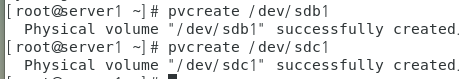
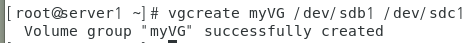
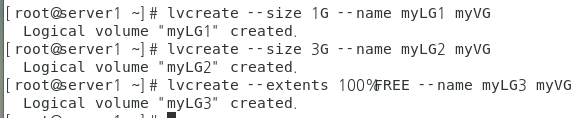
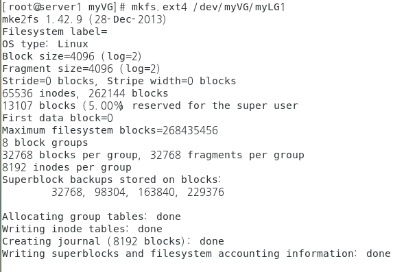
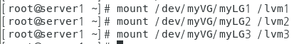
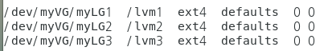

# LVM

* LVM은 논리 하드디스크라는 의미로 여러개의 하드디스크를 ㄹ묶어서 1개의 볼륨그룹으로 만든 후, 다시 필요한 용량의 파티션으로 나눠서 사용하는것.

  

## LVM 구현

1. 생성한 디스크를 fdisk처리
2. 생성한 sdb1과 sdc1에 pvcreate처리
3. pvcreate처리한 두개의 디스크를 vgcreate를 통해 합친다.
4. vgdisplay를 통해 확인
5. lvcreate를 통해 합쳐진 myVG디스크를 원하는 크기로 나눈다.
6. 나누어진 세가지 디스크를 각자 mkfs로 포멧한다.
7. 각 디스크가 마운트 될 폴더를 생성 후 mount.
8. fstab에 설정.

