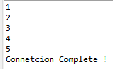
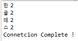

## Java연동

1. install.packages("Rserve")

2. Rserve::run.Rserve() 

   > 자바 대기 서버 실행(서버죽이기가 힘들어서 신중히 실행)

   * Rserve::Rserve()

     > 위 명령어는 서버 죽이기가 힘드므로 백그라운드에서 실행하는 이 명령어 사용
     >
     > 본인의 컴퓨터에서만 들어갈 수 있다.
     >
     > * Rserve::Rserve(args="--RS-enable-remote") 를 통해 외부접속 허용

3. 이클립스에서 프로젝트 생성(external librarys에서 REngine과 RserveEngine파일 등록)

4. Java에서 RConnection을 통해 연결

   ```java
   //R과 연결
   RConnection rconn = null;
   try {
       rconn = new RConnection("192.168.0.20");
       //한글문제 해결
       rconn.setStringEncoding("utf8");
       rconn.eval("source('C:/R/day04/f2.R',encoding='UTF-8')");
   } catch (RserveException e) {
       e.printStackTrace();
   }
   
   System.out.println("Connetcion Complete ! ");
   
   //R 연결종료
   rconn.close();
   ```

5. rexp를 활용해 명령어 전달 & 받기

   ```java
   //R에 명령어 전달
   REXP rexp = rconn.eval("func1("+arg+")");
   //R의 결과값 받기
   int result[] = rexp.asIntegers();
   for(int i: result) {
       System.out.println(i);
   }
   ```

6. 결과 및 코드

   ```java
   public static void main(String[] args) throws REXPMismatchException {
   
       int arg = 10;
   
       //R과 연결
       RConnection rconn = null;
       try {
           rconn = new RConnection("192.168.0.20");
           //한글문제 해결
           rconn.setStringEncoding("utf8");
           rconn.eval("source('C:/R/day04/f2.R',encoding='UTF-8')");
           //R에 명령어 전달
           REXP rexp = rconn.eval("func1("+arg+")");
           //R의 결과값 받기
           int result[] = rexp.asIntegers();
           for(int i: result) {
               System.out.println(i);
           }
       } catch (RserveException e) {
           e.printStackTrace();
       }
   
       System.out.println("Connetcion Complete ! ");
   
       //R 연결종료
       rconn.close();
   }
   ```

   

>백그라운드 R서버가 실행중이라도 소스코드변경이 가능하다.

7. 데이터프레임 리턴값 받기 & 결과

   ```java
   //R의 결과값 받기(데이터프레임)
   RList rlist = rexp.asList();
   String s1[] = rlist.at("x").asStrings();
   int i1[] = rlist.at("y").asIntegers();
   for(int i = 0; i<s1.length;i++) {
       System.out.println(s1[i]+" "+i1[i]);
   }
   ```

   

   