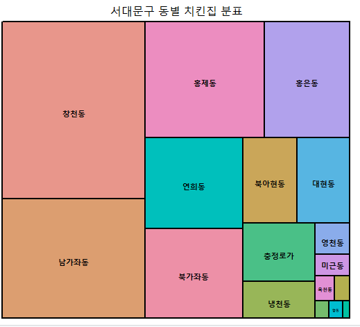

## 데이터분석 실전

### 치킨집 지역 찾기

1. LOCALDATA웹사이트에서 지역다운로드 후 필요한 데이터 가공(p254)


2. 엑셀 데이터 가공 및 트리맵 표현(P257)

   ```R
   library("readxl")
   library("dplyr")
   library("treemap")
   ck <- read_excel("치킨집_가공.xlsx")
   head(ck)
   #소재지전체주소 열에서 11번째 글자부터 16번째 글자 앞까지 추출
   addr <- substr(ck$소재지전체주소, 11, 16)
   head(addr)
   #숫자 공백 제거
   addr_num <- gsub("[0-9]", "", addr)
   addr_trim <- gsub(" ", "", addr_num)
   head(addr_trim)
   #도수분포표 작성 후 데이터프레임으로 변환
   addr_count <- addr_trim %>% table() %>% data.frame()
   head(addr_count)
   #동이름 열(.)과 치킨집 개수 열(Freq)로 트리맵 표현
   treemap(addr_count, index = ".", vSize = "Freq", title = "서대문구 동별 치킨집 분표")
   #내림차순으로 실제 데이터 확인
   arrange(addr_count, desc(Freq)) %>% head()
   ```

3. 결과




