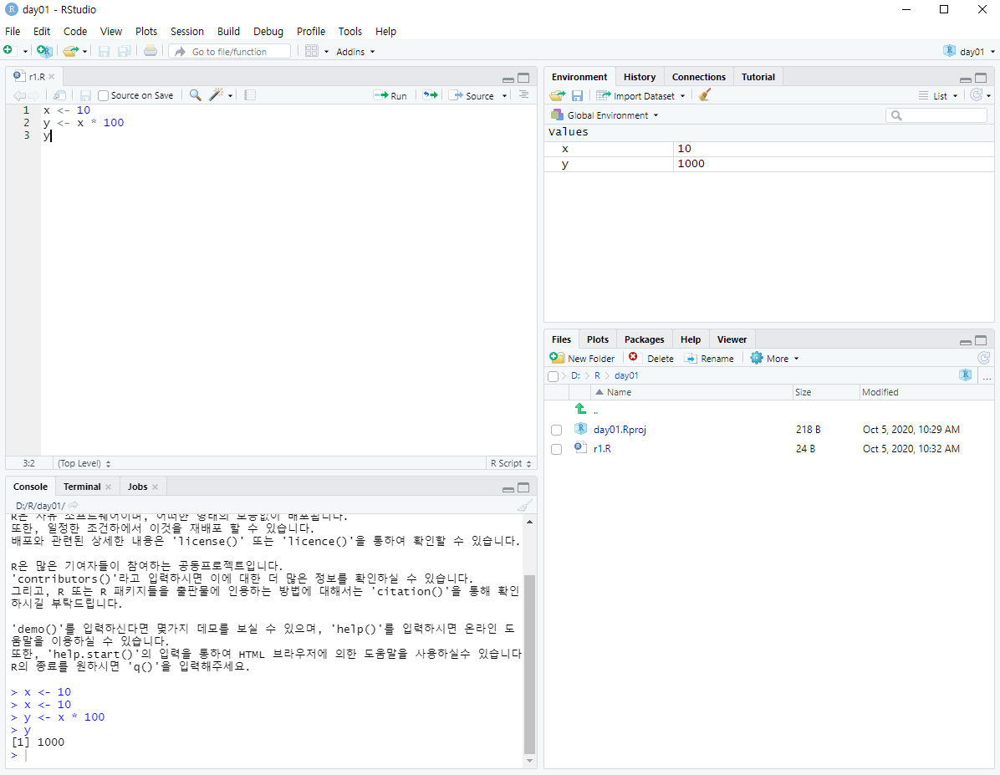
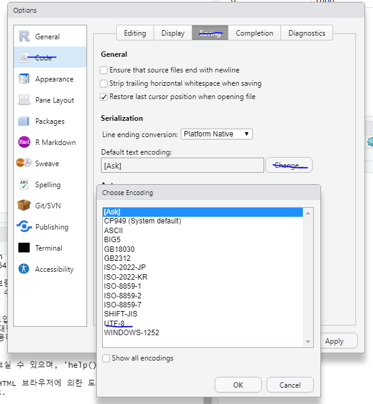

# R

> R 사전준비

* https://ftp.harukasan.org/CRAN/ 에서 R 다운로드 및 설치
* https://rstudio.com/products/rstudio/download/#download 에서 Rstudio설치


## R 스튜디오

> R스튜디오의 화면



* Tools에서 Global Options에 들어가 Default working directory를 변경해준다.

* UTF-8설정도 해준다.

  


## R 교재

* https://thebook.io/006723/ 


## 데이터 타입

### 변수 이름 규칙

> R의 변수명은 알파벳, 숫자, _(언더스코어), .(마침표)로 구성되며, -(하이픈)은 사용할 수 없다. 첫 글자는 **알파벳 또는 .으로 시작**해야 한다. 만약 .으로 시작한다면 . 뒤에는 숫자가 올 수 없다. 예를 들어, 다음은 모두 올바른 변수명이다.

### 변숫값 할당

- 변수에 값을 할당할 때는 `<-` 를 사용

할당 연산자 중 = 는 명령의 최상위 수준에서만 사용

아래 상황에서 = 를 사용하면 x에 값이 저장되지 않는다.

```
  > mean(x = c(1, 2, 3))
  [1] 2
  > x
  Error: object 'x' not found
  >
```

- R 변수
  - 스칼라
  - 벡터
  - 리스트
  - 행렬
  - 배열
  - 데이터 프레임

### 스칼라

> 스칼라란 **단일 차원의 값**을 뜻하는 것으로 숫자 1, 2, 3, …을 예로 들 수 있다. 반면 좌표 평면 위에 있는 점인 (1, 2)는 2차원 값이므로 이 절에서 설명하는 스칼라에 해당하지 않는다.

> R에서 데이터 타입의 기본은 벡터Vector다. 따라서 스칼라 데이터는 길이가 1인 벡터(즉, 길이가 1인 배열)와 같은 것으로 볼 수 있다.

#### NA(Not Available)

> 데이터 값이 없음을 뜻한다.

```
is.na(
	x # R의 데이터 객체
)
```

#### NULL

> NULL은 NULL 객체를 뜻하며, 변수가 초기화되지 않았을 때 사용한다. NULL은 NA와 구분해서 생각해야 한다. 어떤 변수에 NULL이 저장되어 있는지는 is.null( )을 사용해 판단할 수 있다.

| is.null : 변수에 NULL이 저장되어 있는지를 판단한다.          |
| ------------------------------------------------------------ |
| `is.null( x # R의 데이터 객체 )`반환 값은 NULL이 저장되어 있으면 TRUE, 그렇지 않으면 FALSE다. |

#### 문자열

#### 진리값

> TRUE, FALSE 대문자로 사용한다

#### 팩터

> 팩터Factor는 범주형Categorical 데이터(자료)를 표현하기 위한 데이터 타입이다.

```
> sex <- factor("m", c("m", "f"))
# m과 f중에 m이 들어간다
> sex
[1] m
Levels: m f
```

- 여러개의 값 중에 하나가 들어간다

### 벡터(배열과 같다)

> 벡터Vector는 다른 프로그래밍 언어에서 흔히 접하는 배열의 개념으로, 한 가지 스칼라 데이터 타입의 데이터를 저장할 수 있다.

- R의 벡터는 슬라이스Slice를 제공한다. 슬라이스란 배열의 일부를 잘라낸 뒤 이를 또 다시 배열처럼 다루는 개념을 뜻한다.
- 또한, **벡터의 각 셀에는 이름을 부여할 수 있다.** 따라서 벡터에 저장된 요소들을 색인을 사용하여 접근하는 것뿐 아니라 이름을 사용해서도 접근할 수 있다. 이런 특징을 사용하면 데이터를 좀 더 의미 있는 형태로 저장할 수 있다.

| c : 주어진 값들을 모아 벡터를 생성한다.                      |
| ------------------------------------------------------------ |
| `c( ... # 벡터로 모을 R 객체들 )`반환 값은 벡터다.           |
| names : 객체의 이름을 반환한다.                              |
| `names( x # 이름을 얻어올 R 객체 )`반환 값은 x와 같은 길이의 문자열 벡터 또는 NULL이다. |
| names<- : 객체에 이름을 저장한다.                            |
| `names( x # 이름을 저장할 R 객체 ) <- value # 저장할 이름`   |

```
 v1 <- c(1,2,3) # 3행으로 들어간다
names(v1) <- c("d1","d2","d3")

v1[1,3]       # 오류
v1[c(1,3)]    # 1,3번째 값이 출력됨

v1["d1"]
v1[c("d1","d3")]
length(v1)    # 3
NROW(v1)      # 3   /  소문자는 행렬에서만 사용
names(v1)[2]  # "d2"
```

| identical : 객체가 동일한지를 판단한다.                      |
| ------------------------------------------------------------ |
| `identical( x, # R 객체 y # R 객체 )`반환 값은 x와 y가 동일하면 TRUE, 그렇지 않으면 FALSE다. |
| union : 합집합을 구한다.                                     |
| `union( x, # 벡터 y # 벡터 )`반환 값은 x와 y의 합집합이다.   |
| intersect : 교집합을 구한다.                                 |
| `intersect( x, # 벡터 y # 벡터 )`반환 값은 x와 y의 교집합이다. |
| setdiff : 차집합을 구한다.                                   |
| `setdiff( x, # 벡터 y # 벡터 )`반환 값은 x와 y의 차집합이다. |
| setequal : x와 y가 같은 집합인지 판단한다.                   |
| `setequal( x, # 벡터 y # 벡터 )`반환 값은 x와 y가 같은 집합인지 여부다. |

| 연산자       | 의미                                                         |
| ------------ | ------------------------------------------------------------ |
| value %in% x | 벡터 x에 value가 저장되어 있는지 판단함                      |
| x + n        | 벡터 x의 모든 요소에 n을 더한 벡터를 구함. 마찬가지로 *, /, -, == 등의 연산자를 적용 가능함 |

v2 <- v1 + 10

```
> seq(3, 7)     # 1씩 증가
[1] 3 4 5 6 7
> seq(7, 3)     # 1씩 감소
[1] 7 6 5 4 3
> seq(3, 7, 2)  # 2씩 증가
[1] 3 5 7
> seq(3, 7, 3)  # 3씩 증가
[1] 3 6
> 3:7
[1] 3 4 5 6 7
> 7:3
[1] 7 6 5 4 3
```

| rep : 주어진 값을 반복한다.                                  |
| ------------------------------------------------------------ |
| `rep( x, # 반복할 값이 저장된 벡터 times, # 전체 벡터의 반복 횟수 each # 개별 값의 반복 횟수 )`반환 값은 반복된 값이 저장된 x와 같은 타입의 객체다. |

### 리스트 (해시 테이블와 비슷)(k,v)

> 자료 구조 책에서 리스트List는 배열과 비교할 때 데이터를 중간 중간에 삽입하는 데 유리한 구조로 설명한다.

```
> (x <- list(name="foo", height=70))
$ name
[1] "foo"

$ height
[1] 70
list1 <- list(v1 = "data1", v2 = "data2") # =으로 써야함!!

> list1$v1
[1] "data1"

> list1[v1]
$<NA>
NULL
```

### 행렬(동일타입의 2차원 Matrix)

> R의 행렬Matrix은 수학 시간에 배운 행렬의 정의와 같이 행(로우), 열(컬럼)의 수가 지정된 구조다. 벡터와 마찬가지로 행렬에는 **한 가지 유형의 스칼라만 저장**할 수 있다.

```
> matrix(c(1, 2, 3, 4, 5, 6, 7, 8, 9), nrow=3)
     [,1] [,2] [,3]
[1,]    1    4    7
[2,]    2    5    8
[3,]    3    6    9
> matrix(c(1, 2, 3, 4, 5, 6, 7, 8, 9), nrow=3, byrow=TRUE)
     [,1] [,2] [,3]
[1,]    1    2    3
[2,]    4    5    6
[3,]    7    8    9
```

| nrow : 배열의 행의 수를 구한다.                              |
| ------------------------------------------------------------ |
| `nrow( x # 벡터, 배열 또는 데이터 프레임 )`반환 값은 x의 행의 수다. |
| ncol : 배열의 열의 수를 구한다.                              |
| `ncol( x # 벡터, 배열 또는 데이터 프레임 )`반환 값의 x의 열의 수다. |
| dim : 객체의 차원 수를 구한다.                               |
| `dim( x # 행렬, 배열 또는 데이터 프레임 )`반환 값은 x의 차원 수다. |

### 배열(다차원 행렬)

> 행렬이 2차원 데이터라면 배열Array은 다차원 데이터다.

### 데이터 프레임(다중(데이터타입) 행렬)

데이터 프레임Data Frame은 처리할 데이터를 마치 엑셀의 스프레드시트와 같이 표 형태로 정리한 모습을 하고 있다. 데이터 프레임의 각 열에는 관측값의 이름이 저장되고, 각 행에는 매 관측 단위마다 실제 얻어진 값이 저장된다. 예를 들어, 다음 성적 데이터와 같은 모습이 데이터 프레임에 저장되는 데이터의 전형적인 예다.

| 성명   | 국어 | 영어 |
| ------ | ---- | ---- |
| 홍길동 | 80   | 94   |
| 김길동 | 97   | 100  |
| 박길동 | 85   | 97   |

이처럼 자연스럽게 데이터를 표현하는 데이터 타입이기 때문에 데이터 프레임은 R에서 가장 중요한 데이터 타입이며, 많은 R 함수에서 인자로 데이터 프레임을 받는다.

*data.frame( )에 문자열 벡터를 지정할 때 stringsAsFactor를 지정하지 않으면 문자열이 팩터로 바뀌는 것과는 다른 점이다.*

```
> (d <- data.frame(x=c(1, 2, 3, 4, 5),
+                   y=c(2, 4, 6, 8, 10),
+                   z=c('M', 'F', 'M', 'F', 'M')))
   x  y  z
1  1  2  M
2  2  4  F
3  3  6  M
4  4  8  F
5  5 10  M
> d$w <- c("A", "B", "C", "D", "E")
> d              # 새로운 열이 추가됨!
   x  y  z  w
1  6  2  M  A
2  7  4  F  B
3  8  6  M  C
4  9  8  F  D
5 10 10  M  E
```

| 문법               | 의미                                                         |
| ------------------ | ------------------------------------------------------------ |
| d$colname          | 데이터 프레임 d의 컬럼 이름 colname에 저장된 데이터          |
| d[m, n, drop=TRUE] | 데이터 프레임 d의 m행 n 컬럼에 저장된 데이터.m과 n을 벡터로 지정하여 다수의 행과 컬럼을 동시에 가져올 수 있으며 m, n에는 색인뿐만 아니라 행 이름이나 컬럼 이름을 지정할 수 있다.만약 m, n 중 하나를 생략하면 모든 행 또는 컬럼의 데이터를 의미한다.d[, n]과 같이 행을 지정하지 않고 특정 컬럼만 가져올 경우 반환 값은 데이터 프레임이 아니라 해당 컬럼의 데이터 타입이 된다. **이러한 형 변환을 원하지 않으면 drop=FALSE를 지정하여 데이터 프레임을 반환하도록 할 수 있다.** |

#### 유틸리티 함수

데이터를 살펴보기 위한 유틸리티 함수

| head : 객체의 처음 부분을 반환한다.                          |
| ------------------------------------------------------------ |
| `head( x, # 객체 n=6L # 반환할 결과 값의 크기 )`반환 값은 x의 앞부분을 n만큼 잘라낸 데이터다. |
| tail : 객체의 뒷부분을 반환한다.                             |
| `tail( x, # 객체 n=6L # 반환할 결과 값의 크기 )`반환 값은 x의 뒷부분을 n만큼 잘라낸 데이터다. |
| View : 데이터 뷰어를 호출한다.                               |
| `View( x, # 데이터 프레임으로 강제 형 변환한 뒤 뷰어로 볼 데이터 title # 뷰어 윈도우의 제목 )` |

### 타입판별

데이터 타입 판별 함수

| 함수             | 의미                                     |
| ---------------- | ---------------------------------------- |
| class(x)         | 객체 x의 클래스                          |
| str(x)           | 객체 x의 내부 구조                       |
| is.factor(x)     | 주어진 객체 x가 팩터인가                 |
| is.numeric(x)    | 주어진 객체 x가 숫자를 저장한 벡터인가   |
| is.character(x)  | 주어진 객체 x가 문자열을 저장한 벡터인가 |
| is.matrix(x)     | 주어진 객체 x가 행렬인가                 |
| is.array(x)      | 주어진 객체 x가 배열인가                 |
| is.data.frame(x) | 주어진 객체 x가 데이터 프레임인가        |

### 타입 변환

데이터 타입 변환 함수

| 함수             | 의미                                        |
| ---------------- | ------------------------------------------- |
| as.factor(x)     | 주어진 객체 x를 팩터로 변환                 |
| as.numeric(x)    | 주어진 객체 x를 숫자를 저장한 벡터로 변환   |
| as.character(x)  | 주어진 객체 x를 문자열을 저장한 벡터로 변환 |
| as.matrix(x)     | 주어진 객체 x를 행렬로 변환                 |
| as.array(x)      | 주어진 객체 x를 배열로 변환                 |
| as.data.frame(x) | 주어진 객체 x를 데이터 프레임으로 변환      |

------

## 엑셀파일 불러오기

콘솔에서 (readxl 패키지를 설치!)

```
install.packages("readxl")
```

스크립트에서

```
library(readxl)
ex1 <- read_excel("엑셀파일주소")
str(ex1)
```

`read_excel()` 사용!

## TXT,CSV 파일 불러오기

- 구분자가 `,` 로 되어있는 경우

```
ex1 <- read.table("price.csv",
                   sep = ",",
                   header = T,
                   fill = T   # 결측값을 NA로 채워준다!!
                  )
str(ex1)
```

`read.table` 사용!

한글 컨트롤이 예민하다..

- encoding / fileEncoding

외부에서 가져오면 typeof로 꼭 데이터구조 확인한다!!

(데이터프레임이 아닐 수 도 있다.)

CSV 파일 입출력 함수

| read.csv : CSV 파일을 데이터 프레임으로 읽어들인다.          |
| ------------------------------------------------------------ |
| `read.csv( file, # 파일명 header=FALSE, # 파일의 첫 행을 헤더로 처리할 것인지 여부 # 데이터에 결측치가 포함되어 있을 경우 R의 NA에 대응시킬 값을 지정한다. # 기본값은 "NA"로, "NA"로 저장된 문자열들은 R의 NA로 저장된다. na.strings="NA", # 문자열을 팩터로 저장할지 또는 문자열로 저장할지 여부를 지정하는 데 사용한다. 별다른 # 설정을 하지 않았다면 기본값은 보통 TRUE다. stringsAsFactors=default.stringsAsFactors() )`반환 값은 데이터 프레임이다. |
| write.csv : 데이터 프레임을 CSV로 저장한다.                  |
| `write.csv( x, # 파일에 저장할 데이터 프레임 또는 행렬 file="", # 데이터를 저장할 파일명 row.names=TRUE # TRUE면 행 이름을 CSV 파일에 포함하여 저장한다. )` |

- `.rda` 파일은 R만 아는 파일이다

## dplyr 패키지

### 컬럼이름 바꾸기

```
library(dplyr)  #dplyt 라이브러리 설치
sh <- read.csv("shop2.txt",
               header = T,
               stringsAsFactors=F,
               fileEncoding = "UTF-8"
)
sh <- rename(sh, ID=TX_ID, NAME=TX_NM, AGE=TX_A, TEMP=TX_T,PRICE=TX_P, QT=TX_Q)
#rename 사용가능(A, B=C) A에서 C를 B로 바꾼다 
```

- ifelse를 3항연산자 처럼 사용

  ```
  sh$AGE_NY <- ifelse(sh$AGE >= 25, "Y", "N")
  ```

## psych 패키지

install.packages("psych")

library(psych)

- describe()

## descr 패키지

install.packages("descr")

library(descr)

- summarise()

------

sh2 <- sh %>% select(-ID,-AGE,-GRADE) sh3 <- sh %>% filter(GRADE == 'G' & AGE_HL == 'M' & TEMP != 'NA') mean(sh3$TOTAL) sh4 <- sh %>% arrange(desc(AGE), MM)

smr <- sh %>% summarise(TOT = sum(PRICE), AGES = mean(AGE)) smr2 <- sh %>% group_by(NAME) %>% summarise(TOTAVG = mean(PRICE * QT)) #List smr3 <- as.data.frame(smr2)

<details class="details-reset details-overlay details-overlay-dark" id="jumpto-line-details-dialog" style="box-sizing: border-box; display: block;"><summary data-hotkey="l" aria-label="Jump to line" role="button" style="box-sizing: border-box; display: list-item; cursor: pointer; list-style: none;"></summary></details>


 