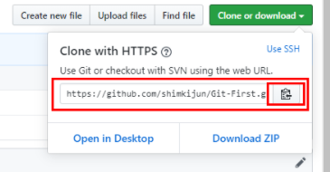
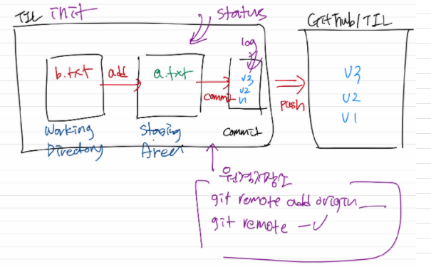

# 원격저장소 활용하기

## 존재하는 레파지토리 가져오기

1. 새로 만든 폴더에 git init실행



2. 폴더에서 gitbash실행 후 git clone 주소복사 -> 후 엔터
3. ls 로 파일목록 확인


## 충돌 상황

* 원격저장소의 이력과 로컬저장소의 이력이 다르다.

```bash
$ git push -u origin master
To https://github.com/jinujeon/remote.git
 ! [rejected]        master -> master (fetch first)
# 에러!
error: failed to push some refs to 'https://github.com/jinujeon/remote.git'
# rejected(거절되었다) - 원격저장소의 작업이 로컬에 없다.
hint: Updates were rejected because the remote contains work that you do
hint: not have locally. This is usually caused by another repository pushing
# 너는 원할것 같다. 원격저장소의 변경사항을 먼저 통gkq(integrate)하기를. 다시 push 하기전에
hint: to the same ref. You may want to first integrate the remote changes
hint: (e.g., 'git pull ...') before pushing again.
hint: See the 'Note about fast-forwards' in 'git push --help' for details.
```

* 해결 방법

  ```bash
  $ git pull origin master
  ```

  * 이렇게 하면, vim 창으로 커밋 메시지를 작성하도록 뜬다.

    ```bash
    Merge branch 'master' of https://github.com/jinujeon/remote
    
    # Please enter a commit message to explain why this merge is necessary,
    # especially if it merges an updated upstream into a topic branch.
    #
    # Lines starting with '#' will be ignored, and an empty message aborts
    # the commit.
    ```

  * 자동으로 작성된 커밋메시지를 확인하고, `:wq`로 나간다.

  * 그 이후 log를 확인하고, push를 한다.

    ```bash
    $ git log --oneline
    9becb7f (HEAD -> master) Merge branch 'master' of https://github.aster
ff12057 로컬에서 작업함
    98e57d9 (origin/master) Create remote.txt
    548230d Update
    a526519 Update
    bb71743 Add README
    ```
    

## github 상황 개요



