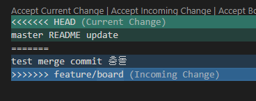
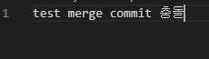

### 상황 1. fast-foward

> fast-foward는 feature 브랜치 생성된 이후 master 브랜치에 변경 사항이 없는 상황

1. feature/test branch 생성 및 이동

   ```bash
   $ git checkout -b feature/test
   ```

2. 작업 완료 후 commit

   ```bash
   $ touch test.html
   $ git add .
   $ git commit -m 'Complete test'
   ```


3. master 이동

   ```bash
   $ git checkout master
   Switched to branch 'master'
   ```


4. master에 병합

   ```bash
   $ git merge feature/test
   Updating 5833cf1..88bf840
   Fast-forward
    test.html | 0
    1 file changed, 0 insertions(+), 0 deletions(-)
    create mode 100644 test.html
   ```


5. 결과 -> fast-foward (단순히 HEAD를 이동)

   ```bash
   $ git log --oneline
   88bf840 (HEAD -> master, feature/test) Complete test
   5833cf1 Complete Test2
   2e32152 Init
   ```

6. branch 삭제

   ```bash
   $ git branch -d feature/test
   Deleted branch feature/test (was 88bf840).
   ```
   
   

---

### 상황 2. merge commit

> 서로 다른 이력(commit)을 병합(merge)하는 과정에서 ***다른*** 파일이 수정되어 있는 상황
>
> git이 auto merging을 진행하고, commit이 발생된다.

1. feature/signout branch 생성 및 이동

   ```bash
   $ git checkout -b feature/signout
   Switched to a new branch 'feature/signout'
   ```

2. 작업 완료 후 commit

   ```bash
   $ touch signout.html
   $ git add .
   $ git commit -m 'Complete signout'
   $ git log --online
   273f142 (HEAD -> feature/signout) Complete signout
   88bf840 (master) Complete test
   5833cf1 Complete Test2
   2e32152 Init
   ```

3. master 이동

   ```bash
   $ git checkout master
   Switched to branch 'master'
   $ git log --oneline
   88bf840 (HEAD -> master) Complete test
   5833cf1 Complete Test2
   2e32152 Init
   ```

4. *master에 추가 commit 이 발생시키기!!*

   * **다른 파일을 수정 혹은 생성하세요!**

   ```bash
   $ touch hotfix.html
   $ git add .
   $ git commit -m 'Hotfix'
   $ git log --online
   $ git log --oneline
   c03b846 (HEAD -> master) Hotfix
   88bf840 Complete test
   5833cf1 Complete Test2
   2e32152 Init
   ```

5. master에 병합

   ```bash
   $ git merge feature/signout
   
   Merge made by the 'recursive' strategy.
    signout.html | 0
    1 file changed, 0 insertions(+), 0 deletions(-)
    create mode 100644 signout.html
   ```

6. 결과 -> 자동으로 *merge commit 발생*

   * vim 편집기 화면이 나타납니다.
   
   * 자동으로 작성된 커밋 메시지를 확인하고, `esc`를 누른 후 `:wq`를 입력하여 저장 및 종료를 합니다.
      * `w` : write
      * `q` : quit
      
   * 커밋이  확인 해봅시다.
   
7. 그래프 확인하기

   ```bash
   $ git log --oneline --graph
   *   a147515 (HEAD -> master) Merge branch 'feature/signout' into master
   |\
   | * 273f142 (feature/signout) Complete signout
   * | c03b846 Hotfix
   |/
   * 88bf840 Complete test
   * 5833cf1 Complete Test2
   * 2e32152 Init
   ```

8. branch 삭제

   ```bash
   $ git branch -d feature/signout
   Deleted branch feature/signout (was 273f142).
   ```
   
   

---

### 상황 3. merge commit 충돌

> 서로 다른 이력(commit)을 병합(merge)하는 과정에서 동일 파일이 수정되어 있는 상황
>
> git이 auto merging을 하지 못하고, 해당 파일의 위치에 라벨링을 해준다.
>
> 원하는 형태의 코드로 직접 수정을 하고 merge commit을 발생 시켜야 한다.

1. feature/board branch 생성 및 이동

   ```bash
   $ git checkout -b feature/board
   Switched to a new branch 'feature/board'
   ```

2. 작업 완료 후 commit

   ```bash
   $ touch board.html
   # README 파일도 수정한다.
   $ git add .
   $ git commit -m 'board & README'
   $ git log --online
   $ git log --oneline
   56b5926 (HEAD -> feature/board) board & README
   a147515 (master) Merge branch 'feature/signout' into master
   c03b846 Hotfix
   273f142 Complete signout
   88bf840 Complete test
   5833cf1 Complete Test2
   2e32152 Init
   ```


3. master 이동

   ```bash
   $ git checkout master
   Switched to branch 'master'
   ```


4. *master에 추가 commit 이 발생시키기!!*

   * **동일 파일을 수정 혹은 생성하세요!**

   ```bash
   # master에서도 README파일을 수정한 후
   $ git add .
   $ git commit -m 'update README'
   $ git log --oneline
   618bd0a (HEAD -> master) update README
   a147515 Merge branch 'feature/signout' into master
   c03b846 Hotfix
   273f142 Complete signout
   88bf840 Complete test
   5833cf1 Complete Test2
   2e32152 Init
   ```

5. master에 병합

   ```bash
   $ git merge feature/board
   # 자동 병합을 하고 있는데...
   Auto-merging README.md
   # 충돌!
   CONFLICT (content): Merge conflict in README.md
   Automatic merge failed; 
   # 충돌을 고치고, 결과를 커밋하세요.
   fix conflicts and then commit the result.
   ```


6. 결과 -> *merge conflict발생*

   ```bash
   $ git status
   On branch master
   # 병합되지 않은 파일들이 있습니다.
   You have unmerged paths.
   # 충돌을 고치고, commit하세요.
     (fix conflicts and run "git commit")
     # 병합을 취소하려면 아래 명령어 사용
     (use "git merge --abort" to abort the merge)
   # staging area
   # -> 충돌이 일어나지 않은 파일들
   Changes to be committed:
           new file:   board.html
   # working directory
   # -> 충돌이 일어난 파일
   Unmerged paths:
   	# 해결하고 add 하세요!!!
     (use "git add <file>..." to mark resolution)
           both modified:   README.md
   ```


7. 충돌 확인 및 해결

   * 충돌이 일어난 파일 내부
   
   
   
   * 해결한 뒤의 파일 내부
   
   
   
   ```bash
   # 해결한 뒤에
   $ git add .
   ```


8. merge commit 진행

    ```bash
    $ git commit
    ```

   * vim 편집기 화면이 나타납니다.
   
   * 자동으로 작성된 커밋 메시지를 확인하고, `esc`를 누른 후 `:wq`를 입력하여 저장 및 종료를 합니다.
      * `w` : write
      * `q` : quit
      
   * 커밋이  확인 해봅시다.
   
9. 그래프 확인하기

    ```bash
   $ git log --oneline --graph
   *   21eb166 (HEAD -> master) Merge branch 'feature/board' into master
   |\
   | * 37476b5 (feature/board) board & README
   | * 56b5926 board & README
   * | 618bd0a update README
   |/
   *   a147515 Merge branch 'feature/signout' into master
   |\
   | * 273f142 Complete signout
   * | c03b846 Hotfix
   |/
   * 88bf840 Complete test
   * 5833cf1 Complete Test2
   * 2e32152 Init
   ```


10. branch 삭제

    ```bash
    $ git branch -d feature/board
    Deleted branch feature/board (was 37476b5).
    ```
    

